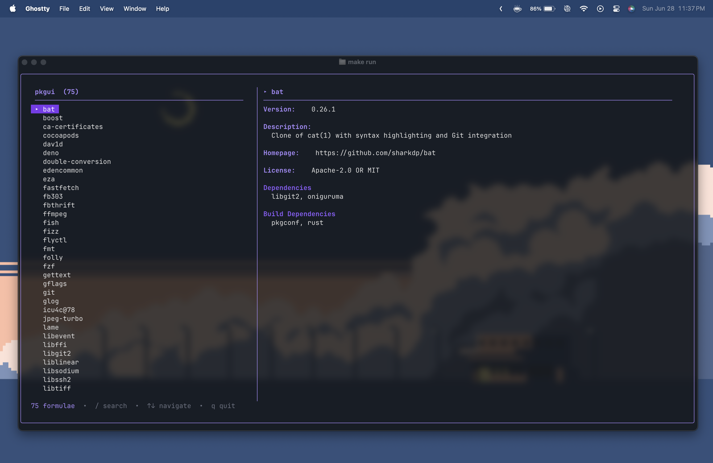

# pkgui

A TUI to manage multiple package managers and packages installed by them.

> Written in Go using BubbleTea

## Features

- List installed packages
- Fuzzy search installed packages

## Support

- Homebrew
  - formulae

## Preview

